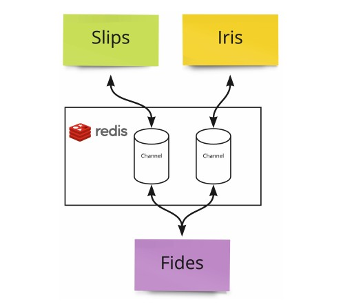
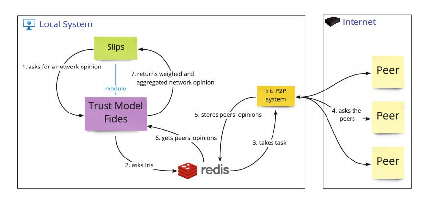
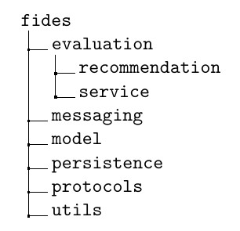

# Architecture

[Slips](https://github.com/stratosphereips/StratosphereLinuxIPS) is a modular software. Each module is designed to perform a spe-
cific detection in the network traffic. The modules can also be used to
extend Slips with any additional functionality directly. Fides was designed
for seamless interoperability with Slips, and in addition to the generic trust
model, we developed the Fides module for Slips. In this document, we describe the architecture of Fides and how it interacts with the network and with Slips.

Figure 1: Fides high-level architecture that visualizes communication between Fides, Iris and Slips.
From the high-level perspective (see Figures 1 and 2), the trust model
Fides communicates with two different systems - Slips and the network
layer [Iris](https://github.com/HappyStoic/iris). Fides manages the trust relationships in the network, 
aggregates threat intelligence data, and communicates with Slips. 
The communication with the remote peers in the network is facilitated by Iris. Slips
then produces and consumes the threat intelligence and defends the network against intruders.
Fides exposes and consumes an API built using the Redis channels
for both parts (Figure 1). The messages and API calls are consumed using the JSON data format.

[Redis](https://redis.io/) is an in-memory data structure store that supports asynchronous
channels and a publish-subscribe model. Moreover, it can also persist
data on disk if required. We chose to employ Redis channels as the medium
that allows communication between the Iris and Fides and allows them to
use their respective APIs because Slips already uses Redis for its internal
communication between modules. It brings no additional overhead to run
Fides with its network layer.

## Fides & Network Access

Figure 2: High-level overview of communication between Fides, Iris and
Slips including examples of messages that sends to each other.
Fides itself is a trust model and it does not interact with the network
directly, but rather it exposes an API that can be used either to receive
the information from the network or for sending the requests back to the
network. Thanks to this design, where all business logic is separated from
the network layer, Fides is highly modular and does not depend on the
network layer implementation. The network layer Iris then performs all
data transfers and facilitates all communications with the remote peers. It
also facilitates finding new peers and ensuring that all requests from Fides
are dispatched to the correct recipients. In the eyes of Fides, the network
layer is a black box and it does not need to know how the network layer is
implemented. See Figure 2 for a high-level overview of the communication.
The network layer, Iris, was developed by Bc. Martin Řepa [here](https://dspace.cvut.cz/bitstream/handle/10467/101308/F3-DP-2022-Repa-Martin-diploma_thesis_iris.pdf) where
Řepa describes how Iris works in detail and what protocols are used to safely
deliver necessary information and messages between the instances of Fides.

## Implementation
Because Fides was designed to integrate with Slips, we were constrained
by the Slips implementation and for that reason we implemented Fides in Python version 3.8.
We chose to use Conda for managing the dependencies and Python versions. Fides package structure is then following:

The implementation is split into multiple Python packages. The package [evaluation](https://github.com/stratosphereips/fides/tree/design_docs/fides/evaluation) contains all necessary algorithms for any data evaluation.
All interaction evaluation strategies can be found in the file
[ti_evaluation.py](https://github.com/stratosphereips/fides/blob/design_docs/fides/evaluation/ti_evaluation.py), all methods for aggregating threat intelligence are in the file [ti_aggregation.py](https://github.com/stratosphereips/fides/blob/design_docs/fides/evaluation/ti_aggregation.py). The evaluation.recommendation package contains all computations that are related to the recommendations and reputation as described in the [Recommendation Trust Metric Section](https://github.com/stratosphereips/fides/blob/design_docs/doc/design.md#recommendation-trust-metric) . Similarly, the package [evaluation.service](https://github.com/stratosphereips/fides/tree/design_docs/fides/evaluation/service) stores algorithm for computing the service trust described in [Service Trust Section](https://github.com/stratosphereips/fides/blob/design_docs/doc/design.md#service-trust).
The package [messaging](https://github.com/stratosphereips/fides/tree/design_docs/fides/messaging) is a connector that allows Fides to send and receive
data from the Redis and thus from the Iris. There is a [network_bridge.py](https://github.com/stratosphereips/fides/blob/design_docs/fides/messaging/network_bridge.py)
which allows Fides to send a message to Iris and Slips via message queue and
[message_handler.py](https://github.com/stratosphereips/fides/blob/design_docs/fides/messaging/message_handler.py) which on the other hand is designed for receiving, message syntax validation and parsing of messages. The package model stores
all data classes that represent the data Fides operate with. The next package [persistence](https://github.com/stratosphereips/fides/tree/design_docs/fides/persistence) then contains the implementation of the Fides’s persistence
layer which we describe more in the Configuration Section. The next package [protocols](https://github.com/stratosphereips/fides/tree/design_docs/fides/protocols)
contains all data processing and Fides’s decision process. The last package
is [utils](https://github.com/stratosphereips/fides/tree/design_docs/fides/utils) where we store our implementation of logging.
In the end, we wrote 6159 lines of code in total where the trust model
Fides itself accounts for 2691 lines. The rest of the implementation is related
to the [unit tests, integration tests](https://github.com/stratosphereips/fides/tree/design_docs/tests), simulation framework, simulations and
the [Slips module](https://github.com/stratosphereips/fides/tree/design_docs/slips). We also set up a simple continuous [integration pipeline](https://github.com/stratosphereips/fides/blob/design_docs/.github/workflows/ci.yml)
for executing the unit and integration tests in GitHub.

### Configuration
Our trust model contains many different configuration options either related to the computational model itself or to the data persistence or identity
of the local peer.
Computational model settings are for example the threat intelligence
aggregation methods described in [Network Intelligence Aggregation Section](https://github.com/stratosphereips/fides/blob/design_docs/doc/design.md#network-intelligence-aggregation).
The configuration itself is in a single YAML file that is in the repository root in [fides.conf.yml](https://github.com/stratosphereips/fides/blob/master/fides.conf.yml) . 

This file is loaded and validated during the
trust model startup and is used to provide all possible configuration options
for the trust model.

### Persistence
Fides stores trust-related data such as past interactions, cached network
opinions, service trust, recommendations, etc. inside the database. The
database layer was implemented as an abstract part and can be easily replaced in the future. As of now, we have two different implementations.
An in-memory database and a database that stores data in Redis. However, thanks to its modularity, different persistence solutions can be easily
implemented.

### Data Filtering
Part of the configuration is the section about data confidentiality and
sharing of the threat intelligence with other peers. Fides allows operators
to choose what threat intelligence will be shared, when, and to whom.
For example, if the threat intelligence received from the local Slips instance contains a confidentiality level, the operator can enforce that only
peers with high service trust will receive this threat intelligence when they
ask for it.
The confidentiality level, __cl__, 0 ≤ __cl__ ≤ 1, defines how sensitive or confidential the threat intelligence is where __cl__ = 0 means public information that
can be shared with anybody and __cl__ = 1 secret information that should not
be shared at all.
The Fides administrator can then specify what service trust __st__ is required
for what confidentiality level, __cl__, in the configuration. If
this configuration is in place, whenever a remote peer (j) asks for threat intelligence and the local (i) Slips has the requested threat intelligence, Fides
verifies that __st(i,j)__ ≥ __cl__ before providing the intelligence to the remote peer.

This mechanism ensures that Slips does not leak information that is private or somehow more sensitive than the others.